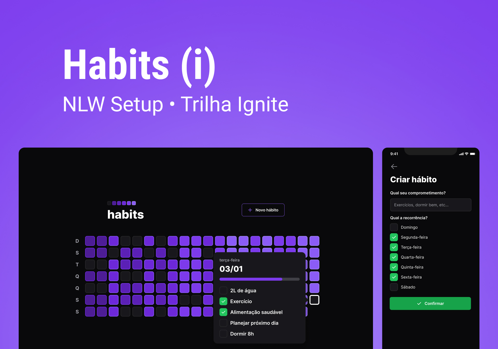
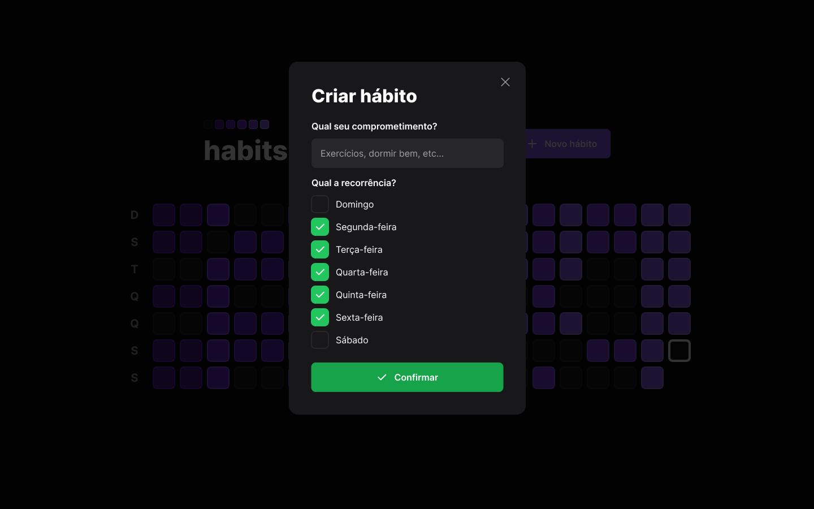
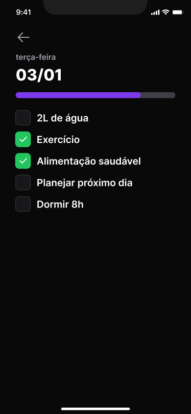

<p align="center">
   
</p>

<p align="center">
   
</p> 
<hr><br/>

<p align="center">
  <a href="#-sobre">Sobre</a> &#xa0; | &#xa0;
  <a href="#telas-da-aplicação">Telas</a> &#xa0; | &#xa0;
  <a href="#skateboard-funcionalidades">Funcionalidades</a> &#xa0; | &#xa0;
  <a href="#rocket-tecnologias">Tecnologias</a> &#xa0; | &#xa0;
  <a href="#white_check_mark-requisitos-para-rodar-a-aplicação">Requisitos</a> &#xa0; | &#xa0;
  <a href="#checkered_flag-iniciando">Iniciando</a> &#xa0; | &#xa0;
  <a href="#-configurações-adicionais-ao-projeto">Schemas</a> &#xa0; | &#xa0;
  <a href="#memo-licença">Licença</a> &#xa0; | &#xa0;
  <a href="https://github.com/pedrob14" target="_blank">Autor</a>
</p>

<br>

## 😸 Sobre ##

Projeto desenvolvido durante as aulas do Ignite NLW Setup - Habits patrocinado pela <a href="https://rocketseat.com.br/"> Rocketseat</a>.
Neste evento vimos como usar tecnologias atuais e poderosas na construção de sistemas simples ou avançados,este projeto é completo com parte web(ReactJs), server(Backend com Node) e mobile(ReactNative).

## Telas da aplicação

### Tela Home Desktop ##


## Tela Novo Hábito Desktop ##



## Tela Splash Mobile ##


## Tela Home Mobile ##


## Tela dia especifico Mobile ##



## Tela criar hábito Mobile ##


## :skateboard: Funcionalidades ##

:heavy_check_mark: Criar um novo Hábito\
:heavy_check_mark: Mostrar tela home com hábitos criados e progresso\
:heavy_check_mark: Marcar hábito como completo ou desmarcalo\
:heavy_check_mark: Aplicação responsiva

## :rocket: Tecnologias ##

Abaixo poderá ter acesso às principais tecnologias usadas neste projeto

- [ReactNative](https://reactnative.dev/)
- [NativeBase](https://nativebase.io/)
- [Expo](https://expo.dev/)
- [AndroidStudio](https://developer.android.com/studio)
- [TypeScript](https://www.typescriptlang.org/)
- [Svg-Transformer](https://github.com/kristerkari/react-native-svg-transformer)
- [Phosphor Icons](https://github.com/duongdev/phosphor-react-native)
- [Prisma](https://www.prisma.io/)
- [Fastfy](https://www.fastify.io/)
- [Tailwindcss](https://tailwindcss.com/)
- [NativeWind](https://www.nativewind.dev/)
- [Radix-ui](https://www.radix-ui.com/)
- [React-native-vector-icons](https://oblador.github.io/react-native-vector-icons/)
- [React-Native-Reanimated](https://docs.swmansion.com/react-native-reanimated/)


## :white_check_mark: Requisitos para rodar a aplicação ##

Antes de iniciar :checkered_flag:, você precisa ter [Git](https://git-scm.com) e [Node](https://nodejs.org/en/) instalado em seu sistema operacional, a CLI do Expo e o app Expo Go.Não sabe como fazer isso? Criamos abaixo uma documentação para ajudar vocês nesse processo [CLIdoExpo](https://efficient-sloth-d85.notion.site/Instalando-Expo-a4042eaea57d40fabeeaa2e462424ff0).

## :checkered_flag: Iniciand Frontend Mobile  ##

```bash
# Clone este projeto
$ git clone https://github.com/juniorvilas/nlw-setup.git

# Acesse
$ cd/nlw-setup/mobile

# Instale as dependências
$ npm i

# Execute o projeto
$ npx expo start
```

## :checkered_flag: Iniciando Frontend Web  ##

```bash
# Clone este projeto
$ git clone https://github.com/juniorvilas/nlw-setup.git

# Acesse
$ cd/nlw-setup/web

# Instale as dependências
$ npm i

# Execute o projeto
$ npm run dev
```

## :checkered_flag: Iniciando Backend (server)  ##

```bash
# Clone este projeto
$ git clone https://github.com/juniorvilas/nlw-setup.git

# Acesse
$ cd/nlw-setup/server

# Instale as dependências
$ npm i

# Execute o projeto
$ npm run dev
```


## 📡 Material complementar para o projeto ##

- [Wallpapers-NLW-SETUP](https://drive.google.com/drive/folders/1F5ghUWdlaC_1IKFxkNUgGcTGqpqdpR29)
- [Notion-Trilha-Ignite](https://efficient-sloth-d85.notion.site/Trilha-Ignite-562e3516c7574fb7be75ff01fbb41f54)
## :memo: Licença ##

Este projeto está sob licença MIT. Para mais informações acesse [LICENSE](LICENSE.md).

Feito com :heart: por <a href="https://github.com/juniorvilas" target="_blank">Carlindo Junior</a>

&#xa0;

<a href="#top">Voltar ao topo</a>
- [O que é o Habits?](#o-que-é-o-habits)
- [Tecnologias](#tecnologias)
- [Como executar?](#como-executar)

## O que é o Habits?

<b>Habits</b> é uma aplicação desenvolvida durante o evento da Next Level Week da Rocketseat que possibilita o usuário:

- Cadastrar um novo hábito;
- Visualizar os hábitos de cada dia;
- Acompanhar todo o progresso dos hábitos.

## Tecnologias

Foram utilizadas as seguintes tecnologias e ferramentas:

- [NodeJS](https://nodejs.org/)
- [TypeScript](https://www.typescriptlang.org/)
- [Fastify](https://www.fastify.io/)
- [Prisma](https://www.prisma.io/)
- [ViteJS](https://vitejs.dev/)
- [ReactJS](https://reactjs.org/)
- [TailwindCSS](https://tailwindcss.com/)
- [React Native](https://reactnative.dev/)
- [Expo](https://expo.io/)

## Como executar?

### Web

```bash
# Install the web dependencies
$ cd web
$ npm install

# Start the web project
$ npm run dev
```

### Server

```bash
# Install the server dependencies
$ cd server
$ npm install

# Start the server project
$ npx prisma migrate deploy
$ npm run dev
```

### Mobile

```bash
# Install the mobile dependencies
$ cd mobile
$ npm install

# Start the mobile project
$ npm start
```

Acesse o projeto <link do Projeto aqui> para ver o resultado!

---

Feito com 💜 por [Pedro Farias](https://github.com/pedrob14) 